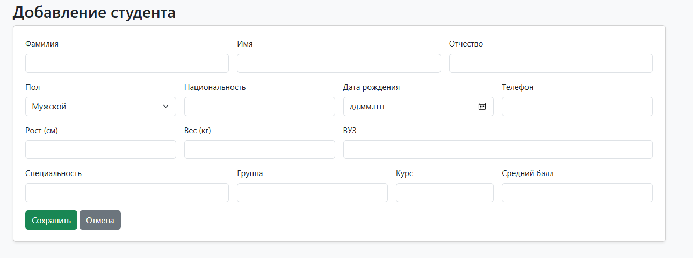
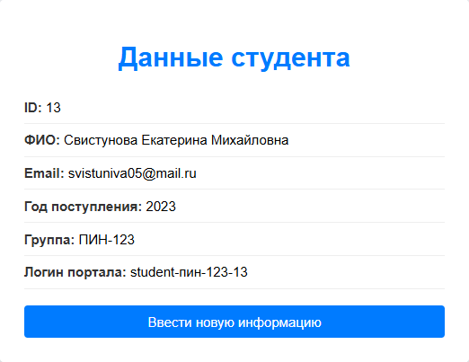
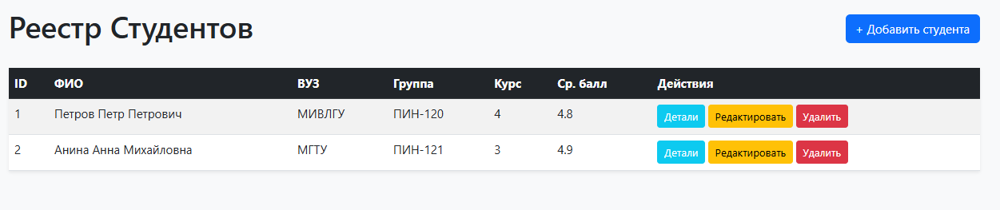
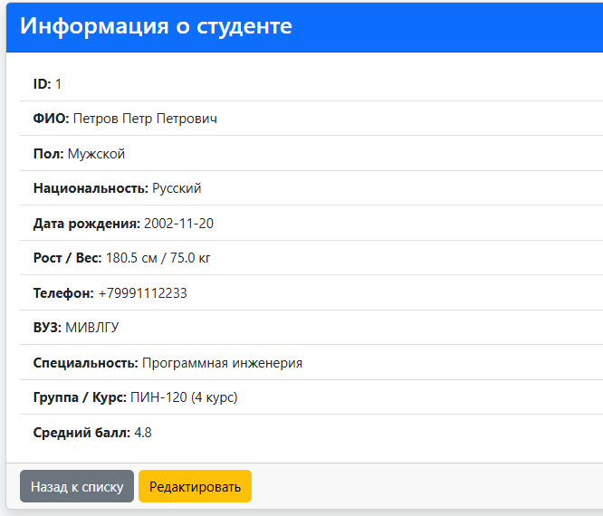
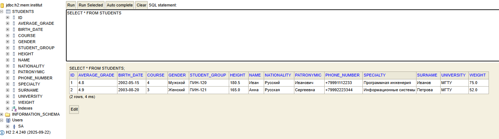

# Отчет по лабораторной работе №1

## Цель работы
Изучить базовые принципы работы фреймворка Spring Boot и шаблонизатора Thymeleaf на примере создания веб-приложения для сбора, обработки данных формы студента и автоматической генерации атрибутов (учебной группы и логина).

## Архитектура проекта

* **Стек:** Java 25, Spring Boot 4.1.1, Maven, Thymeleaf, HTML5, CSS3.
* **Основные слои:**
    * **Model:** Класс `Student` — инкапсулирует данные формы (ID: 13, ФИО, e-mail, год поступления: 2023) и бизнес-логику формирования производных полей (название группы: `ПИНз-123`, логин: `student-pinz123-13`).
    * **Controller:** Класс `MainController` — обрабатывает входящие HTTP-запросы (`GET`, `POST`), связывает данные модели с HTML-представлениями.
    * **View (Представление):** HTML-шаблоны (`main-form.html`, `result.html`) с разметкой Thymeleaf для динамического рендеринга данных.
* **Ключевые аннотации:**
    * `@Controller` — объявляет класс в качестве Spring MVC контроллера, возвращающего представления.
    * `@GetMapping` — маппинг HTTP GET запросов для отображения страницы с пустой формой.
    * `@PostMapping` — маппинг HTTP POST запросов для приёма и обработки отправленных данных формы.
    * `@ModelAttribute` — связывает параметры входящего HTTP-запроса с полями объекта модели `Student`.

## Алгоритм работы

1. Пользователь отправляет `GET`-запрос по адресу `/form`.
2. Контроллер `MainController` перехватывает запрос, инициализирует пустой объект класса `Student`, добавляет его в контекст `Model` и возвращает шаблон `main-form.html`.
3. Клиент заполняет форму (ID, Фамилия, Имя, Отчество, E-mail, Год поступления) и нажимает кнопку «Отправить», отправляя `POST`-запрос на `/form`.
4. Spring Boot связывает переданные данные с полями объекта `Student` (Data Binding).
5. В контроллере вызывается логика расчета производных данных:
    * **Группа:** формируется по шаблону `ПИНз-1` + две последние цифры года поступления (например, `2023` → `ПИНз-123`).
    * **Логин портала:** формируется по шаблону `student-` + группа + `-` + ID (например, `student-pinz123-13`).
6. Заполненный объект `Student` передается в модель, после чего контроллер возвращает шаблон `result.html`.
7. Страница `result.html` динамически отображает полученные и рассчитанные данные.

## Скриншоты работы приложения

### 1. Форма ввода данных (`/form`)

### 2. Результат обработки данных (`/form` - POST)

# Лабораторная работа №2: Репозиторий в Spring Data JPA

## Цель работы
Изучить способы взаимодействия с реляционной базой данных при помощи Spring Data JPA и H2 Console, реализовав CRUD-операции (создание, чтение, редактирование, удаление) для сущности «Студент» (Вариант 3) с проверкой существования записей и стилизацией пользовательского интерфейса.

## Архитектура проекта
- **Стек:** Java 17, Spring Boot 3, Maven, Thymeleaf, Bootstrap 5[cite: 1, 2]
- **СУБД:** H2 Database (in-memory)[cite: 1, 2]
- **Основные слои:**
    - **Entity (`Student`):** доменная модель данных с полями по варианту №3 (ФИО, пол, национальность, рост, вес, дата рождения, телефон, ВУЗ, курс, группа, средний балл, специальность)[cite: 1].
    - **Repository (`StudentRepository`):** слой доступа к данным на основе `JpaRepository`[cite: 1, 2].
    - **Controller (`StudentController`):** обработка HTTP-запросов (endpoints), управление навигацией и валидацией существования объектов[cite: 1, 2].
    - **View (`templates`):** HTML-страницы с шаблонизатором Thymeleaf и Bootstrap-стилями[cite: 1].
- **Ключевые аннотации:** `@Entity`, `@Table`, `@Id`, `@GeneratedValue`, `@Column`, `@Repository`, `@Controller`, `@RequestMapping`, `@GetMapping`, `@PostMapping`, `@PathVariable`, `@ModelAttribute`, `@Autowired`[cite: 1, 2].

## Алгоритм работы
1. **Настройка зависимостей и конфигурации:**[cite: 1]
    - В `pom.xml` добавлены стартеры `spring-boot-starter-data-jpa` и БД `h2`[cite: 1].
    - В `application.properties` настроены параметры подключения к in-memory базе H2, активация отображения SQL-запросов в консоли, а также включение H2 Console (`/h2-console`)[cite: 1].
2. **Создание сущности и репозитория:**[cite: 1]
    - Сущность `Student` размечена JPA-аннотациями `@Entity`, `@Table`, `@Id` и `@GeneratedValue`[cite: 1].
    - Создан интерфейс `StudentRepository`, наследующий `JpaRepository<Student, Long>`[cite: 1].
3. **Инициализация данных:**[cite: 1]
    - Создан файл `src/main/resources/data.sql` для первоначального заполнения базы данных тестовыми записями студентов[cite: 1].
4. **Реализация веб-слоя (CRUD):**[cite: 1]
    - Реализован `StudentController` со следующими эндпоинтами:[cite: 1]
        - `GET /students` — вывод списка всех студентов[cite: 1].
        - `GET /students/details/{id}` — просмотр подробной информации о студенте с проверкой через `findById()`[cite: 1].
        - `GET /students/create` — отображение формы добавления студента[cite: 1].
        - `GET /students/edit/{id}` — отображение формы редактирования с проверкой существования записи[cite: 1].
        - `POST /students/save` — сохранение/обновление данных студента через `repository.save()`[cite: 1].
        - `GET /students/delete/{id}` — удаление студента по ID с проверкой существования через `existsById()`[cite: 1].
5. **Оформление интерфейса:**[cite: 1]
    - Верстка страниц (`students-list.html`, `student-details.html`, `student-form.html`) выполнена с использованием Bootstrap 5 и синтаксиса Thymeleaf (`th:each`, `th:text`, `th:field`, `th:href` и др.)[cite: 1].

## Скриншоты работы приложения

1. **Главная страница со списком студентов (`/students`):**
   

2. **Детальная информация о студенте (`/students/details/1`):**
   

3. **Форма добавления/редактирования студента (`/students/create`):**
   

4. **Консоль H2 Database (`/h2-console`):**
   
